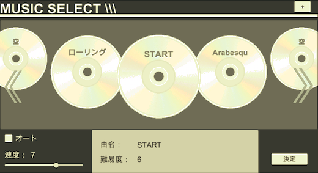

Music Game
====

## 概要
Unityで作った音楽ゲームです。

## デモ(Screen Shots)
* 楽曲選択画面  
 

* 楽曲プレイ画面  


## 対象プラットフォーム
対象プラットフォーム：Android, Windows, MacOS  
※iOSは楽曲データをどうするか問題があるため未対応です。

## 利用方法
* Android  
	1. Unityプロジェクトをビルド。  
	2. Assets内の `GameData` フォルダを以下のパスに格納する。  
	```  
        /storage/emulated/0/Android/data/<packagename>/files
        ```  
	3. アプリを起動する。  
* Windows  
	1. Unityプロジェクトをビルド。  
        2. Assets内の `GameData` フォルダを以下のパスに格納する。  
        ```  
        <path to executablename_ Data folder>/
        ```  
	3. アプリを起動する。  
* MacOS  
	1. Unityプロジェクトをビルド。  
        2. Assets内の `GameData` フォルダを以下のパスに格納する。  
        ```  
        <path to player app bundle>/Contents/
        ```  
	3. アプリを起動する。  

## 開発時Unityバージョン
2019.2.17.f3  
※Unity Test Runnerが使えるバージョンであれば問題ないと思います。

## 課題（今後やること）
* 楽曲リザルト画面の作成。
* ノーツの種類を増やす（同時押し、長押し等）。
* 背景/ノーツ画像の外部ファイル読み込み。
* 楽曲選択画面のノードの見栄えを良くする。
* テストケース（EditorMode, PlayMode）を増やす。
* ソースpush時に自動的にテスト実行されるようにする。
* などなど。

## ライセンス
MIT License
